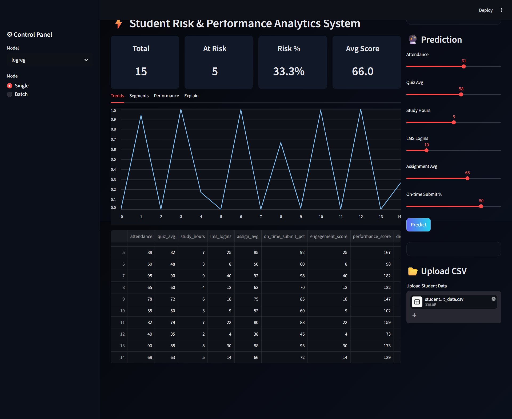
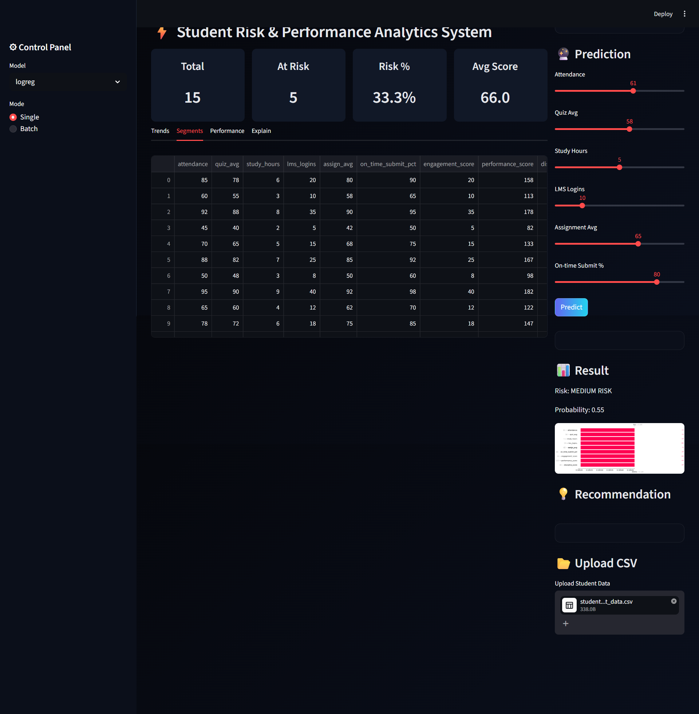
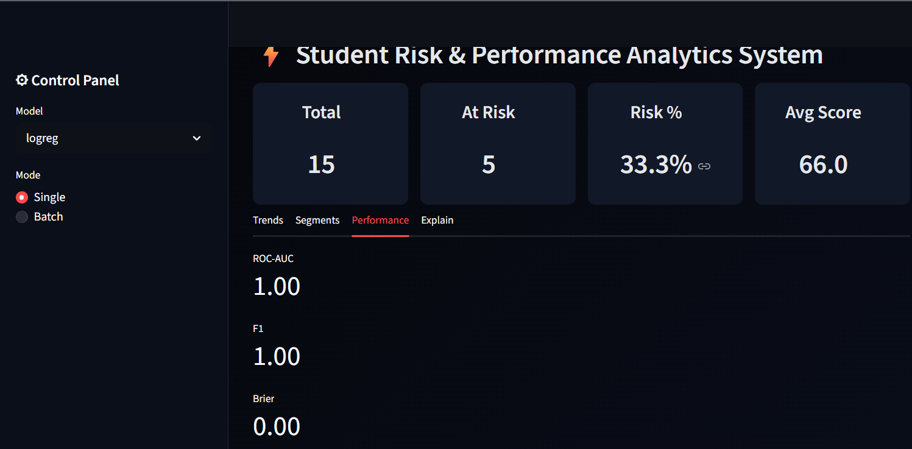
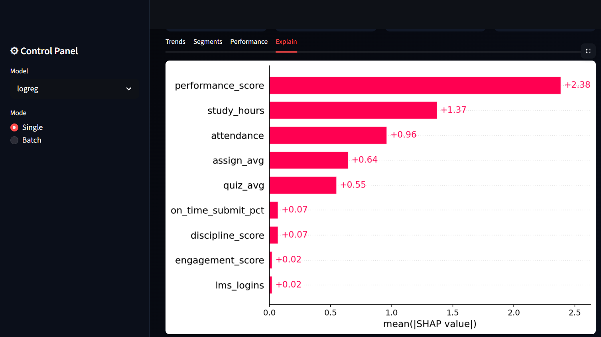
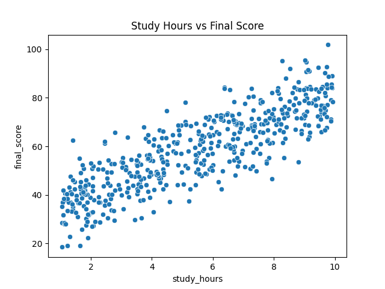

# ⚡ Student Risk & Performance Analytics System

An AI-powered system that predicts student performance, identifies at-risk students, and provides actionable insights using machine learning and analytics.

---

## 📌 Overview

This project is an **end-to-end Machine Learning + Analytics platform** designed to:

- Predict student performance
- Identify at-risk students early
- Provide explainable insights (SHAP)
- Enable data-driven decision-making

It simulates real-world **EdTech analytics systems** used in industry.

---

## ❗ Problem Statement

Educational institutions often struggle to:

- Identify weak students early
- Understand performance drivers
- Take timely intervention actions
- Analyze large-scale student data

This system solves these using **predictive analytics + AI insights**.

---

## 🌍 Industry Relevance

Used in:

- EdTech platforms (Coursera, Byju’s, Udemy)
- Schools & universities
- Learning Management Systems (LMS)

### Use Cases:
- Dropout prediction
- Personalized learning
- Student engagement analysis
- Performance optimization

---

## 🧰 Tech Stack

**Programming**
- Python

**Libraries**
- Pandas, NumPy
- Scikit-learn
- SHAP (Explainable AI)
- Matplotlib

**Frontend**
- Streamlit

**Other**
- Joblib
- Git & GitHub

---

## 🏗️ Architecture

Data → Validation → Feature Engineering → Model → Prediction → Explainability → Dashboard


---

## 📂 Folder Structure

Student-Risk-Performance-Analytics-System/
│
├── data/
├── models/
├── src/
│ ├── feature_engineering.py
│ ├── evaluate_model.py
│ ├── explain.py
│ ├── drift.py
│ ├── recommend.py
│ ├── utils.py
│
├── images/
│ ├── 1.png
│ ├── 2.png
│ ├── 3.png
│ ├── 4.png
│ ├── 5.png
│
├── app.py
├── requirements.txt
├── README.md
└── .gitignore


---

## ⚙️ Installation

```bash
git clone https://github.com/Jui-Ramteke/Student-Risk-Performance-Analytics-System.git

cd Student-Risk-Performance-Analytics-System

python -m venv venv

venv\Scripts\activate   # Windows
# source venv/bin/activate  # Linux/Mac

pip install -r requirements.txt

streamlit run app.py

http://localhost:8501

## 📊 Dashboard Screenshots

### 🔹 1. Main Dashboard Overview
<p align="center">
  
</p>

Displays key KPIs like total students, at-risk students, risk %, and average score.

---

### 🔹 2. Risk Trend Analysis
<p align="center">
  
</p>

Shows how student risk changes over time.

---

### 🔹 3. Model Performance
<p align="center">
  
</p>

Displays evaluation metrics such as ROC-AUC, F1 Score, and Brier Score.

---

### 🔹 4. Explainability (SHAP)
<p align="center">
  
</p>

Explains model predictions using SHAP feature importance.

---

### 🔹 5. Feature Insights
<p align="center">
  
</p>

Shows relationship between study hours and performance.


📈 Results

Accurate student risk prediction

Identification of key performance drivers

Real-time analytics dashboard

Explainable AI insights (SHAP)

Evaluation Metrics:

ROC-AUC

F1 Score

Brier Score


🎯 Key Features

* Student risk prediction

* Multi-model system (LogReg, RF)

* Feature engineering pipeline

* Batch + single prediction

* SHAP explainability

* Drift detection

* Advisor panel

* Search & filtering

* Interactive dashboard


📚 Learning Outcomes

* End-to-end ML pipeline development

* Feature engineering

* Model evaluation & validation

* Explainable AI (SHAP)

* Dashboard development (Streamlit)

* Handling real-world ML issues


👨‍💻 Author

Jui Ramteke

Email: juiramteke20@gmail.com

GitHub: https://github.com/Jui-Ramteke

LinkedIn: https://www.linkedin.com/in/jui-ramteke/